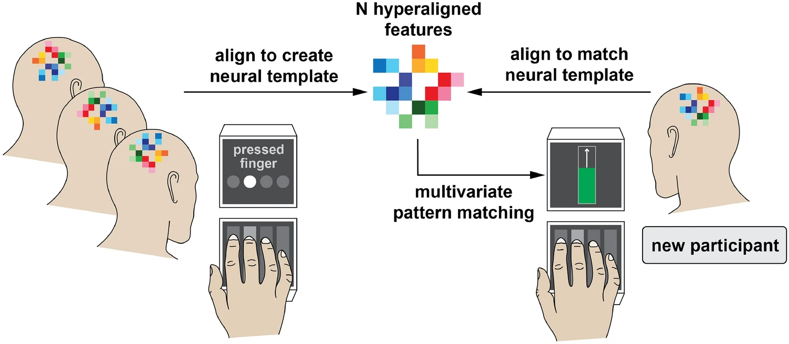
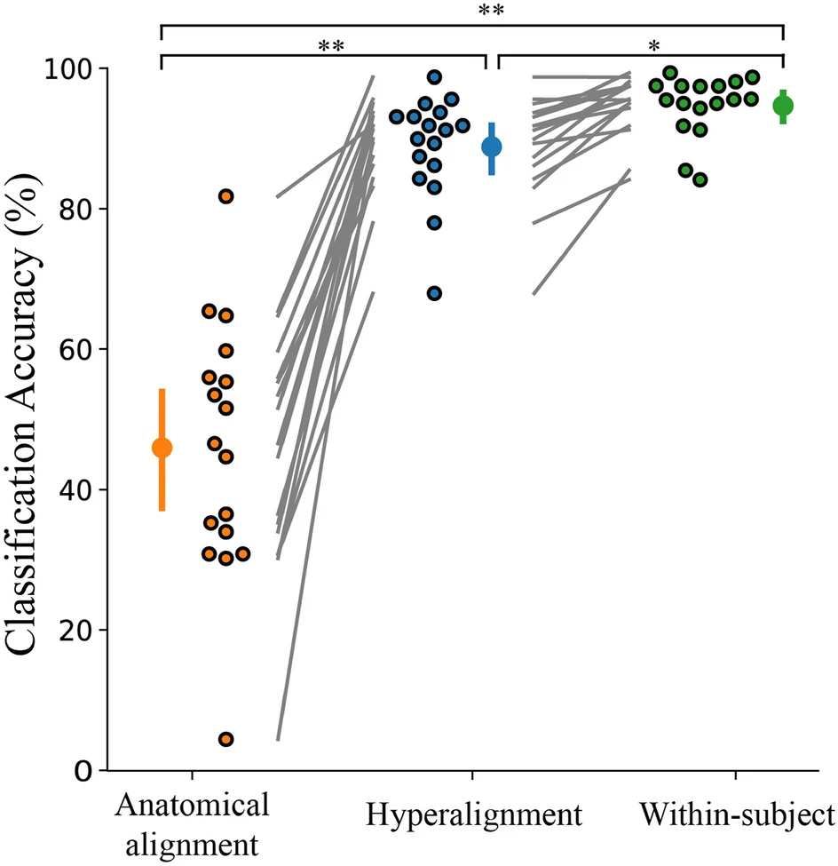
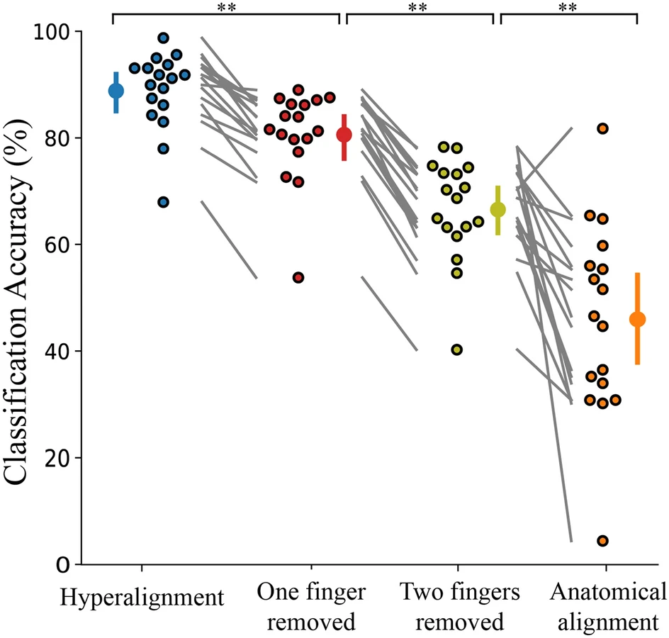

# fMRI Hyperalignment Analysis

This repository contains an **fMRI analysis pipeline implementing functional alignment (hyperalignment)** for cross-subject neural decoding and shared representational modeling.

The methods are based on:

**Kilmarx, J.**, Oblak, E., Sulzer, J., & Lewis-Peacock, J. (2021). Towards a common template for neural reinforcement of finger individuation. _Scientific Reports_, 11(1), 1065.

## Overview

Hyperalignment transforms individual participant data into a **shared representational space** by aligning voxel-wise activity patterns using Procrustean transformations.

This project demonstrates how **hyperalignment** can be used to:
- Align neural representations across participants
- Improve between-subject decoding performance
- Construct a shared neural template for classification

This approach is particularly useful in applications such as **real-time neurofeedback and stroke rehabilitation**, where patients may be unable to generate reliable neural patterns, and surrogate templates derived from healthy individuals are required.

## Key Findings (from original study)

### Hyperalignment Improves Cross-Subject Decoding

- Functional alignment significantly outperforms anatomical alignment
- Enables reliable **decoding of fine-grained motor representations across individuals**  
- Supports construction of a **shared neural template** that generalizes to new participants  

Hyperalignment improved classification accuracy from **~46% (anatomical alignment)** to **~88% (functional alignment)**, approaching within-subject performance.

### Generalization to Missing Data

The model can **infer neural representations that were excluded during hyperalignment**, leveraging shared structure learned from other participants.

Even when specific categories (e.g., individual fingers) were omitted during alignment, the classifier maintained **above-chance performance**, indicating that the common model captures sufficient structure to support inference.

This demonstrates robustness in scenarios where a participant cannot generate all required neural patterns.

## Repository Contents

### Notebook
`hyperalignment_codes.ipynb`

Walkthrough of:
- Preprocessing pipeline
- ANOVA-based feature selection
- Hyperalignment procedure
- Classification and evaluation

### Helper Functions
`hyperalignment_functions.py`

Implements:
- Data loading and preprocessing
- Functional alignment (Procrustes-based hyperalignment)
- Data transformation into common model space
- Classification utilities

## Data Availability

The original dataset is not included in this repository.

This code is provided as:
- an **illustrative analysis pipeline**
- a **reference implementation of hyperalignment methods**

To run the full analysis, users will need to supply their own fMRI data in a compatible format.
